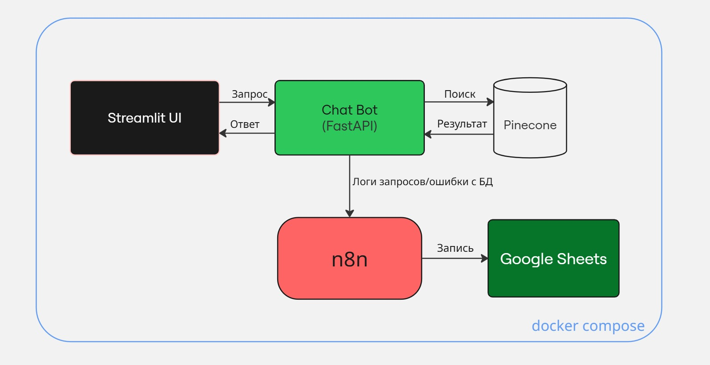

## 📚 Оглавление

- [Архитектура сервиса чат-бота для поиска багов в игре](#архитектура-сервиса-чат-бота-для-поиска-багов-в-игре)
  - [Общая архитектура](#общая-архитектура)
  - [Схема компонентов](#схема-компонентов)
  - [Процесс работы сервиса](#процесс-работы-сервиса)
  - [Компоненты системы](#компоненты-системы)
    - [1. Чат-бот](#1-чат-бот)
    - [2. Pinecone](#2-pinecone)
    - [3. n8n](#3-n8n)
    - [4. Google Sheets](#4-google-sheets)
    - [5. Streamlit](#5-streamlit)
  - [Модель эмбеддинга в сервисе](#модель-эмбеддинга-в-сервисе)
- [🚀 Запуск проекта](#запуск-проекта)
  - [Шаги запуска](#шаги-запуска)
- [🛠 Руководство по импорту workflow n8n](#руководство-по-импорту-workflow-n8n)
  - [Предварительные требования](#предварительные-требования)
  - [Импорт workflow](#импорт-workflow)
    - [Шаг 1: Импорт workflow логирования запросов и ошибок](#шаг-1-импорт-workflow-логирования-запросов-и-ошибок)
    - [Шаг 2: Настройка доступа к Google Sheets](#шаг-2-настройка-доступа-к-google-sheets)
    - [Шаг 3: Активация webhook'а](#шаг-3-активация-webhookа)


# Архитектура сервиса чат-бота для поиска багов в игре

## Общая архитектура

Сервис состоит из следующих основных компонентов:

1. **Чат-бот** - основное приложение, которое обрабатывает запросы пользователей и ищет информацию о багах
2. **Pinecone** - векторная база данных для хранения и поиска векторных представлений информации о багах
3. **n8n** - система автоматизации для логирования запросов и ошибок
4. **Google Sheets** - сервис для хранения логов запросов и ошибок
5. **Streamlit** - веб-интерфейс для взаимодействия с чат-ботом (UI)

## Схема компонентов



## Процесс работы сервиса

1. Пользователь отправляет запрос через Streamlit интерфейс
2. Чат-бот преобразует запрос в векторное представление
3. Чат-бот отправляет векторное представление в Pinecone для поиска ближайшего вектора
4. Pinecone возвращает результаты поиска с метаданными и оценкой схожести
5. Чат-бот анализирует результаты и формирует ответ:
   - Если уверенность выше порога, возвращает найденную информацию
   - Если уверенность ниже порога, отвечает "Не знаю"
6. Чат-бот отправляет логи запроса в n8n и ошибки с векторной БД, в случае их возникновения
7. n8n записывает логи/ошибки в Google Sheets

## Компоненты системы

**Внутренние модули**:
- `src/chatbot_app/main.py` - основной модуль с FastAPI и логикой обработки запросов
- `src/chatbot_app/ui/streamlit_app.py` - модуль веб-интерфейса на Streamlit
- `src/chatbot_app/vector_db.py` - модуль для работы с векторной базой данных Pinecone
- `src/chatbot_app/schemas.py` - модели данных для запросов и ответов
- `src/chatbot_app/config.py` - конфигурационные параметры
- `src/chatbot_app/bug_data.py` - данные багов для загрузки в векторную БД
- `n8n_workflows/n8n_logging.json` - шаблон workflow n8n 

**Основной стек**:
- Python 3.9+
- FastAPI - для создания API обращений
- Sentence Transformers - для векторизации текста
- Streamlit - для пользовательского интерфейса
- Docker - для деплоя

Для деплоя сформирован `docker-compose.yml`

### 1. Чат-бот

**Назначение**: Обработка запросов пользователей, поиск информации в векторной базе данных, формирование ответов.

**Интеграция**: Через FastAPI сфомированы API для обращения через UI и реализации логики работы чат-бота посредством обращения к векторной БД

### 2. Pinecone

**Назначение**: Хранение векторных представлений информации о багах и поиск ближайших векторов.

**Интеграция**:
- Через SDK Pinecone в модуле `src/chatbot_app/vector_db.py`
- Использование cosine similarity для поиска ближайших векторов

### 3. n8n

**Назначение**: Автоматизация логирования запросов и ошибок, мониторинг работоспособности системы.

Реализованы две ноды для google sheets: нода Google-Sheets-Запросы и нода Google-Sheets-Ошибки. Первая нода отправляет в один лист в таблицу логи запросов, вторая нода отправляет в другой лист в таблицу логи об ошибках (в т.ч. с доступом) Pinecone

**Workflow**:
- Предоставлен шаблон workflow для логирования запросов и ошибок
- Реализованы две ноды для google sheets: нода Google-Sheets-Запросы и нода Google-Sheets-Ошибки. Первая нода отправляет в один лист в таблицу логи запросов, вторая нода отправляет в другой лист в таблицу логи об ошибках (в т.ч. с доступом) Pinecone

### 4. Google Sheets

**Назначение**: Хранение логов запросов и ошибок.

**Листы**:
- Запросы - для логирования запросов пользователей
- Ошибки - для логирования ошибок системы

### 5. Streamlit

**Назначение**: Предоставление пользовательского веб-интерфейса для взаимодействия с чат-ботом.

**Функциональность**:
- Отправка запросов к чат-боту через API
- Отображение ответов и истории чата

### Модель эмбеддинга в сервисе

В проекте используется фреймворк Sentence Transformers с моделью cointegrated/rubert-tiny2 (по умолчанию) для векторизации текстов запросов пользователя. Это обеспечивает следующие преимущества:

- Оптимизировано под русский язык: модель rubert-tiny2 специально обучена на русскоязычных данных, что повышает точность поиска багов по смыслу в русскоязычных текстах.

- Компактность и высокая скорость: модель tiny-класса весит меньше, чем стандартные BERT-модели, и позволяет быстро обрабатывать запросы в реальном времени.

- Семантический поиск: эмбеддинги отражают смысл текста, а не только ключевые слова, что позволяет находить баги даже при переформулировке запроса.

- Порог уверенности (по умолчанию 0.65): используется эмпирически подобранный порог косинусной близости. Если результат ниже порога, бот отвечает "Не знаю"

- Модель эмбеддинга легко заменяется или дообучается при необходимости — инфраструктура уже поддерживает Sentence Transformers и использует Hugging Face: если модель не реализована внутри SentenceTransformers, она автоматически ищется на Hugging Face Hub.


# Запуск проекта

## Шаги запуска

1. Клонируйте репозиторий:

   ```bash
   git clone https://github.com/Shoxiing/game-bugs-chatbot.git
   cd game-bugs-chatbot


2. Создайте .env файл на основе .env.example

3. Запустите проект:

   ```bash
      docker-compose up --build

4. Настройте n8n сервис (ниже есть руководство)

5. Перейдите по адресу http://localhost:8501, чтобы открыть интерфейс чат-бота на Streamlit.

# Руководство по импорту workflow n8n

В этом руководстве описано, как импортировать workflow n8n для интеграции с чат-ботом.

## Предварительные требования

1. Запущенный n8n (локально или в Docker(в проекте запускается через docker compose))
2. Авторизация в n8n
3. Учетная запись Google с доступом к Google Sheets

## Импорт workflow

### Шаг 1: Импорт workflow логирования запросов и ошибок

1. Откройте интерфейс n8n в браузере (через данный проект согласно docker-compose http://localhost:5678)
2. Нажмите на кнопку "+" -> "Workflow" либо "Create Workflow"
3. Нажмите на кнопку "Import from file"
4. Выберите файл `n8n_workflows/n8n_logging.json` в проекте

### Шаг 2: Настройка доступа к Google Sheets

1. Предварительно убедитесь, что есть авторизация в сервисе Google Cloud (документация как это сделать: https://docs.n8n.io/integrations/builtin/credentials/google/oauth-single-service/) и созданы необходимые credentials для доступа к Google Sheets
2. Откройте импортированный workflow
3. Нажмите на ноды "Google Sheets - Запросы/Ошибки" 
4. В настройках выберите свои credentials (Credential to connect with)
5. Следуйте инструкциям для аутентификации
6. После настройки подключения, создайте таблицы в каждом из листов документа в Google Sheet.
Для корректной работы рабочих процессов, ваш документ Google Sheets должен содержать следующие листы с таблицами со столбцами:

    Лист "Запросы" 
    | Время | Запрос | Количество результатов | ID бага | Уверенность |
    |-------|---------|------------------------|---------|------------|

    Лист "Ошибки"
    | Время | Тип ошибки | Сообщение |
    |-------|------------|-----------|

7. Убедитесь, что в во вкладках документа есть листы "Запросы" и "Ошибки" с соответствующими заголовками.
8. Вернитесь к настройке workflow и в нодах "Google Sheets - Запросы/Ошибки"  укажите URL адрес документа в поле Document by URL
8.1 Настройте запись данных для ноды **"Google Sheets - Запросы"** в поле **Fields to Send** согласно листу **Запросы** из таблицы документа Google Sheets:
    
  | Field Name or ID       | Field Value                          |
  |------------------------|--------------------------------------|
  | Время                 | `{{ $json.body.timestamp }}`         |
  | Запрос                | `{{ $json.body.query }}`             |
  | Количество результатов | `{{ $json.body.results_count }}`     |
  | ID бага               | `{{ $json.body.top_result_id }}`     |
  | Уверенность           | `{{ $json.body.top_result_score }}`  |
  
8.2 Аналогично для ноды **"Google Sheets - Ошибки"**:

  | Field Name or ID | Field Value                           |
  |------------------|---------------------------------------|
  | Время            | `{{ $json.body.timestamp }}`          |
  | Тип ошибки       | `{{ $json.body.error_type }}`         |
  | Сообщение        | `{{ $json.body.error_message }}`      |
  
 
### Шаг 3: Активация webhook'а
В шаблоне `n8n_workflows/n8n_logging.json` должен быть указан URL webhook'а на ноде Webhook, но если нет или хотите изменить, то следующие шаги:

1. Нажмите на ноду "Webhook"
2. Скопируйте URL webhook'а
3. Укажите в файл `.env` этот URL. Пример:
```
N8N_WEBHOOK_URL=http://n8n:5678/webhook/game-bugs-chatbot/query-log ( в качестве имени хоста n8n, так как запускаем в docker-compose.yml все сервисы )
```
4. Сохраните рабочий процесс
5. Нажмите кнопку "Active" для активации рабочего процесса
